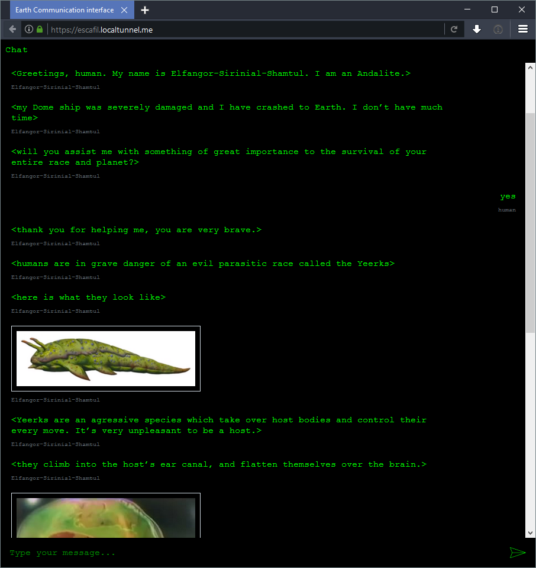

# BotFramework-WebChat-terminal-theme
Delightful green and black webchat theme for your bots! :robot:

## Introduction

This theme is compatible with the Microsoft Bot Framework open source [WebChat library](https://github.com/microsoft/BotFramework-WebChat). It's a collection of CSS tweaks to make a running WebChat instance look like an old school green and black terminal interface. Great for intergalactic chatbot conversations!

### Screenshot

## Instructions

1. Clone the official [BotFramework-WebChat repo](https://github.com/microsoft/BotFramework-WebChat) and follow the directions to connect it to your Microsoft Bot Framework App.
2. Clone this repo in a separate location.
3. Copy the `scss` directory under `src` in this repository and use it to replace the same `scss` directory in the WebChat repo you cloned earlier.
4. Follow the [BotFramework-WebChat repo's instructions](https://github.com/microsoft/BotFramework-WebChat#building-webchat) on how to recompile the styles to update them.
4. [Host the newly themed WebChat instance on the cloud](https://github.com/microsoft/BotFramework-WebChat#how-to-add-webchat-to-your-website) so others can use it to chat with your bot.
4. Enjoy! Or tweak further to your heart's content :sparkles:

